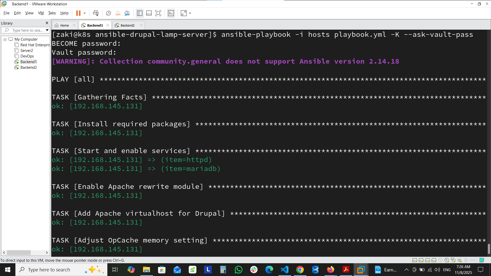
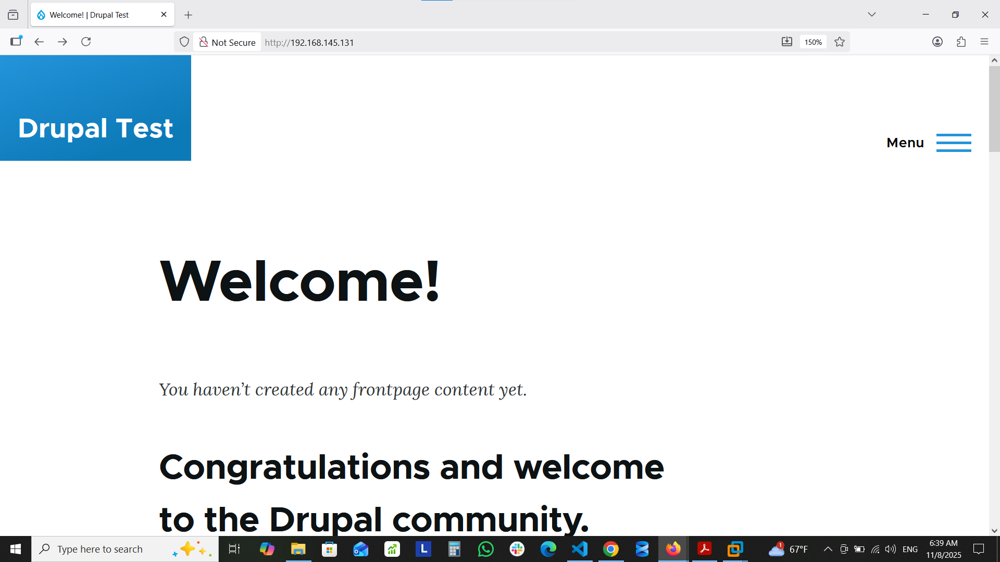
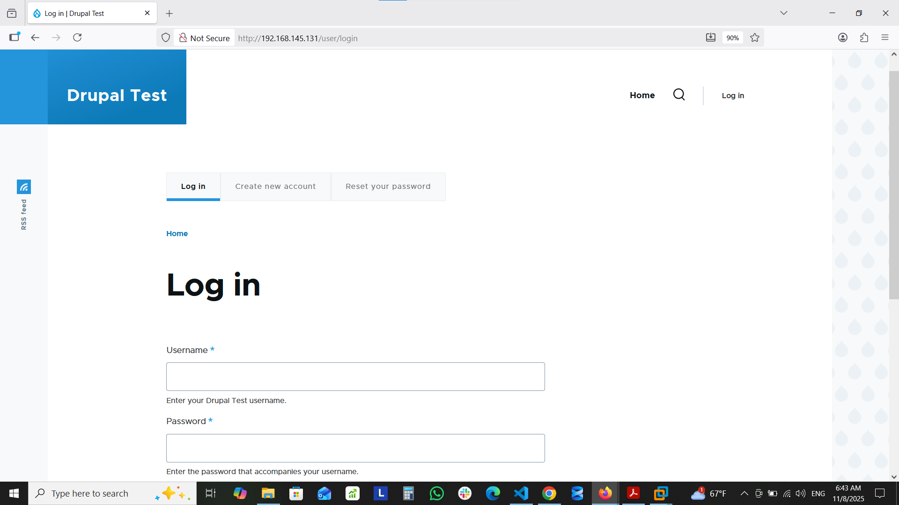

# Drupal LAMP Stack Deployment with Ansible


## 📋 Project Overview
Automated deployment of a complete Drupal LAMP stack on Red Hat using Ansible. Features secure credential management with Ansible Vault.

## 📁 Project Structure
```text
ansible-drupal-lamp-server/
├── playbook.yml              
├── vars.yml                  
├── secrets.yml               
├── hosts                     
├── templates/
│  └── drupal.test.conf.j2   
├── docs/
│  ├── site.png
│  ├── db.png
│  ├── playbook-success1.png
│  ├── playbook-success2.png
│  ├── tables.png
│  ├── apache-status.png
│  └── mariadb-status.png
└── README.md
```
## 🖼️ Demonstration
- #### Ansible Playbook Execution
 
- #### Drupal Website
 
- #### Database Verification


## 🚀 Quick Deployment
#### 1. Clone & Configure
```bash
git clone https://github.com/Mohamedzaakii/ansible-drupal-lamp-server.git
cd ansible-drupal-lamp-server

# Edit hosts file with server IP
echo "server-ip" > hosts
```
#### 2. Set Up Encrypted Credentials
```bash
ansible-vault create secrets.yml
```
Add to secrets.yml:
```bash
mysql_root_password: "the_secure_password"
mysql_drupal_password: "the_secure_password"
```
#### 3. Deploy
```bash
ansible-playbook -i hosts playbook.yml -K --ask-vault-pass
```
#### 4. Access
- ##### URL: http://server-ip
- ##### Admin: admin / admin

## ⚙️ Configuration
#### vars.yml
```bash
drupal_core_path: "/var/www/drupal"
domain: "drupal" 
drupal_site_name: "Drupal Test"
php_version: "8.2"
```
#### secrets.yml (Encrypted)
```bash
mysql_root_password: "encrypted_password"
mysql_drupal_password: "encrypted_password"
```
## 🗄️ Database
- Name: drupal
- User: drupal
- Location: /var/lib/mysql/drupal/
#### Verify: mysql -u drupal -p -e "USE drupal; SHOW TABLES;"

## 🔒 Security
- Ansible Vault encrypted credentials
- Secure database configuration
- Proper file permissions
## 📝 License

MIT License


